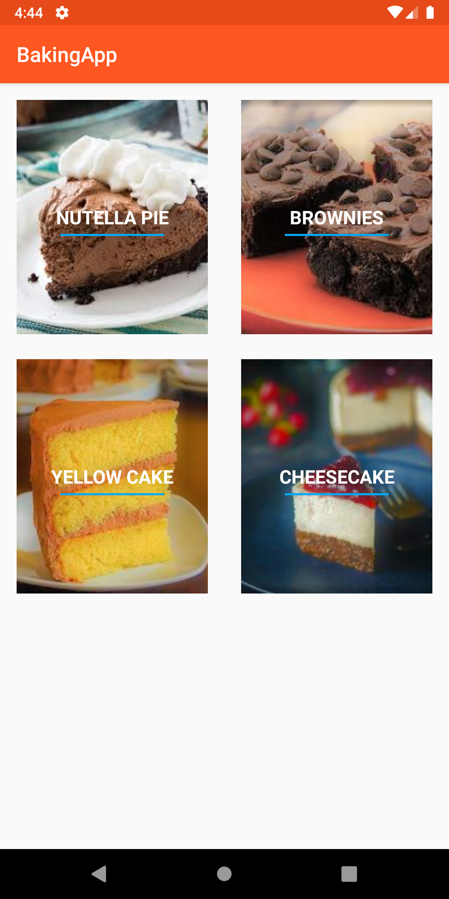
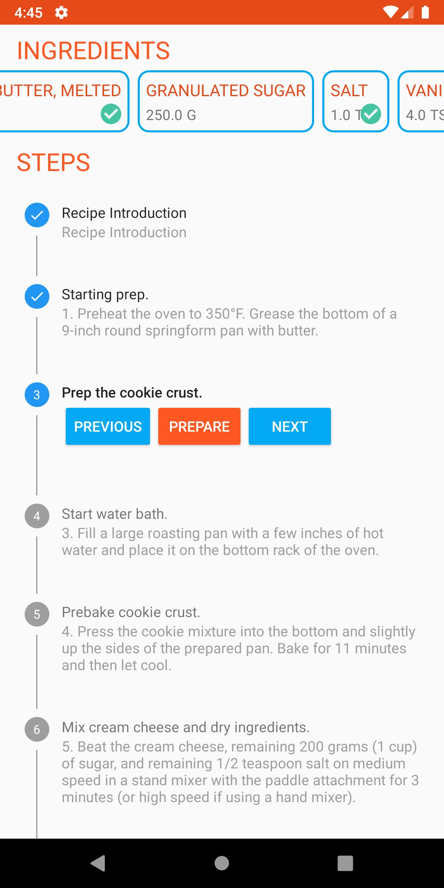
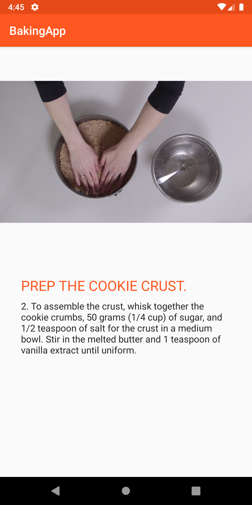
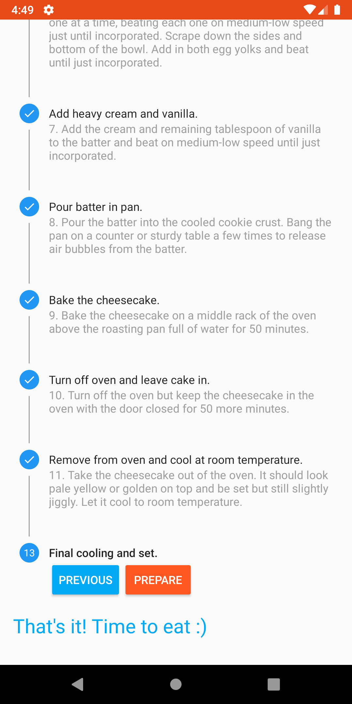
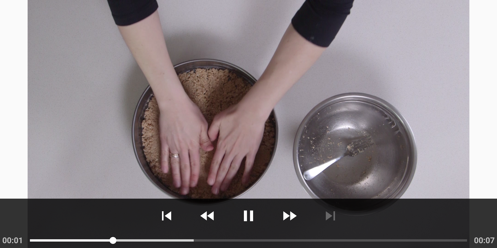
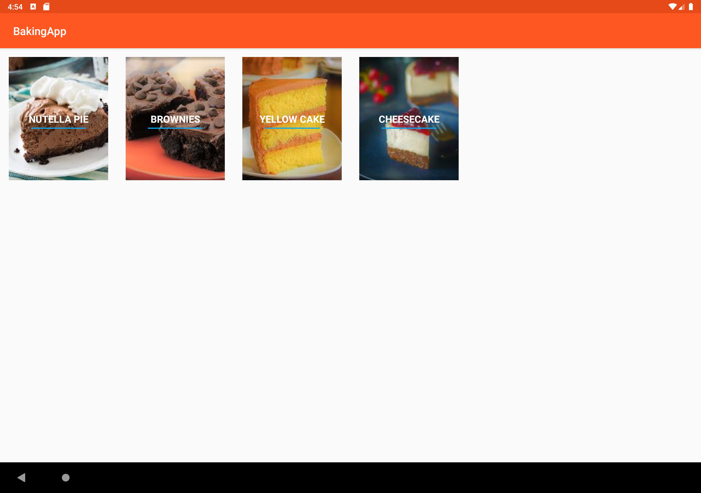
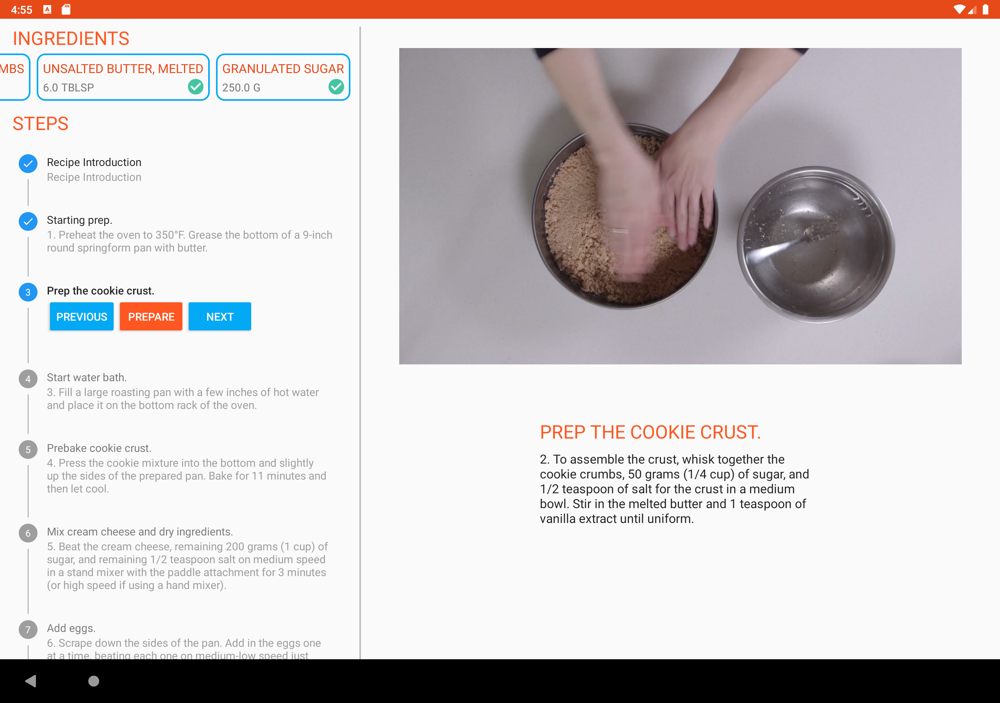

### App Description
This application is a simple digital version of recipe books. There are a few ( 4 at the time of building, circa Apr 2020) recipes of bakery products like cheesecake uploaded as endpoint. The app queries and displays the recipes. Upon selecting a recipe, a detailed step-by-step guide is shown. At the top, there is a scrollable list of ingredients. You can mark the ingredient by simply tapping on it. A vertical stepper view (please refer build.gradle on app level) is used to display those steps. Navigating from steps is done using Previous and Next buttons. A prepare activity for each step includes details of that step. Some steps have videos which are shown using simple ExoPlayer.
The layout is different for tablets. A master detail flow is used to use the extra space on tablet devices.

### How to use
Simply clone the repository. You can open the app in Android Studio to install the app or use ADB or gradle if you are a terminal person.

### Screenshots
#### Mobile Devices

	
	
	
	
	

#### Tablet Devices (With Master Detail Flow)

	
	

Kindly note that the portrait orientation in tablets is using master detail flow which is not ideal. Although it is not broken, it does not look good. The app should behave like it is in portrait mobile when it is in portrait tablet. 

### Plan ahead
Make app more stable. There are few scenraios I need to optimise as well. For example, there should be a smooth transition from landscape to portrait mode while watching video. Upcoming commits on this folder (after I have collected all the apps in this compilation), I will change orientations discussed above in tablet devices. Current plan is to use smallest width identifier, sw720dp and so to correctly identify device and change activity layouts.

### That is it for this app!
This was the assignment where a lot of effort was needed. In fact, this assignment was more challenging that other. The best part about it was open room for customised implementations as long as the requirements are met and are user friendly.