### App Description
This application was developed as a capstone project for Udacity Nanodegree and was a final project for graduation. Most of the development was done in 2 days. Adding widget and adding support for R to L languages was necessary in order to pass the assesment. This app uses [NewsAPI](https://www.newsAPI.org) endpoints to collect news from various sources and different fields and show them under one hood. The app also provides simple UI and shortcuts to open full article in browser or save the article for future reading. One can share the article with simple tap. Firebase is used to authenticate the users along with Google account OAuth.

### How to use
Simply clone the repository. You can open the app in Android Studio to install the app or use ADB or gradle if you are a terminal person. You need an API key to get news from NewsAPI which you can get [here](https://newsapi.org/register) for free under developer plan. Removing authentication activities could be useful if app is to be used for private purpose.

### Screenshots
#### Mobile Devices

	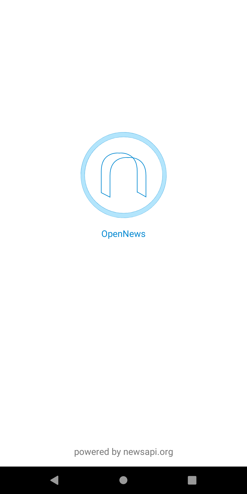
	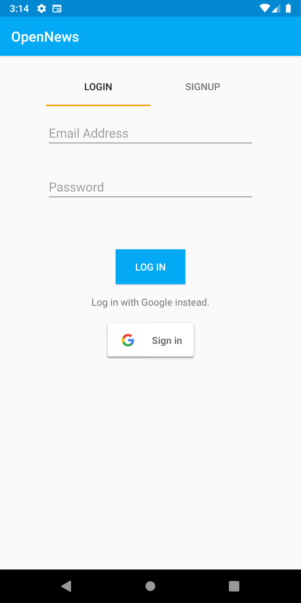
	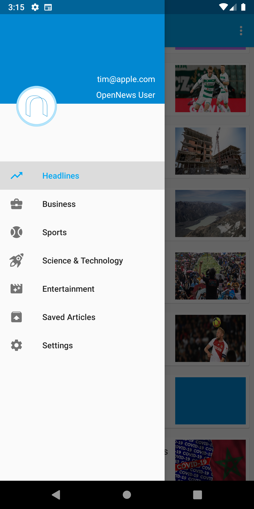
	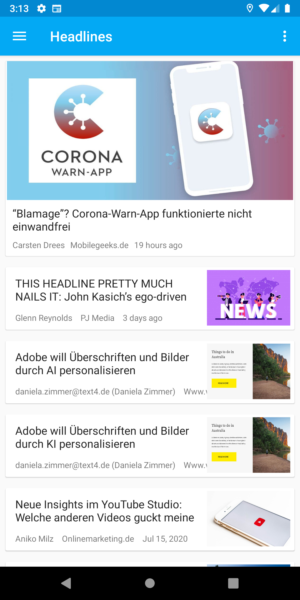
	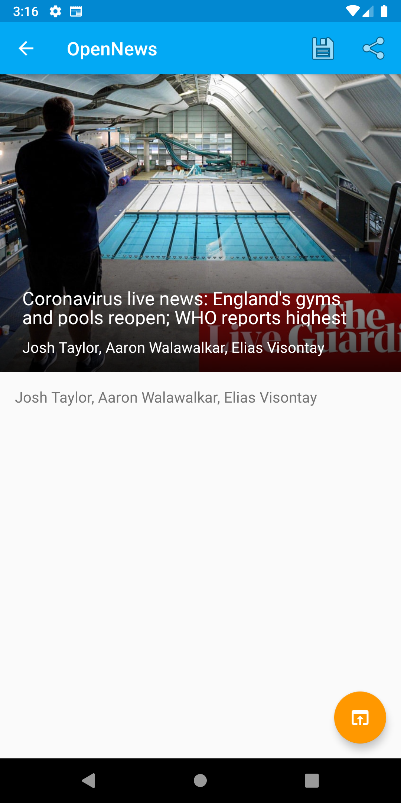
	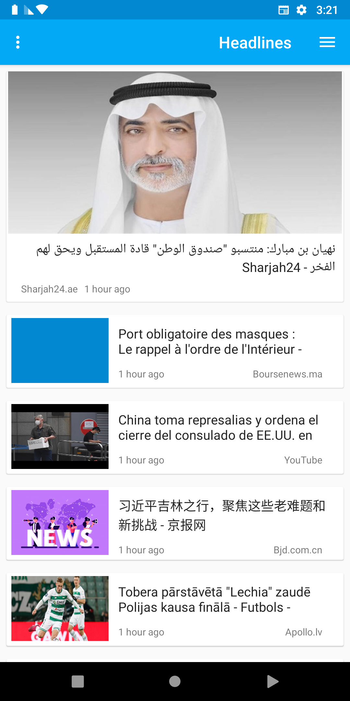
	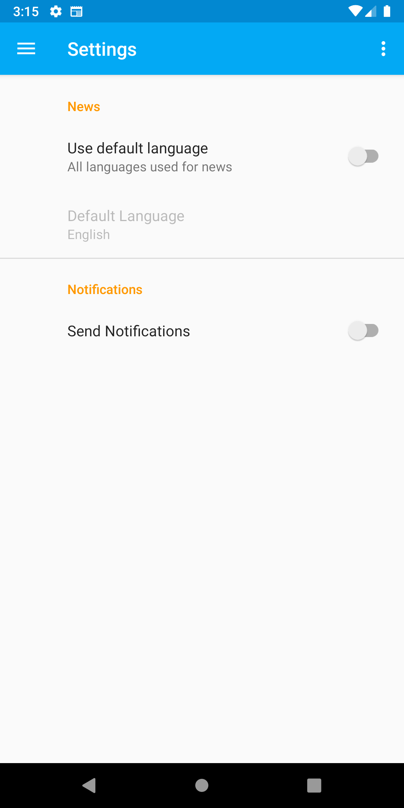
	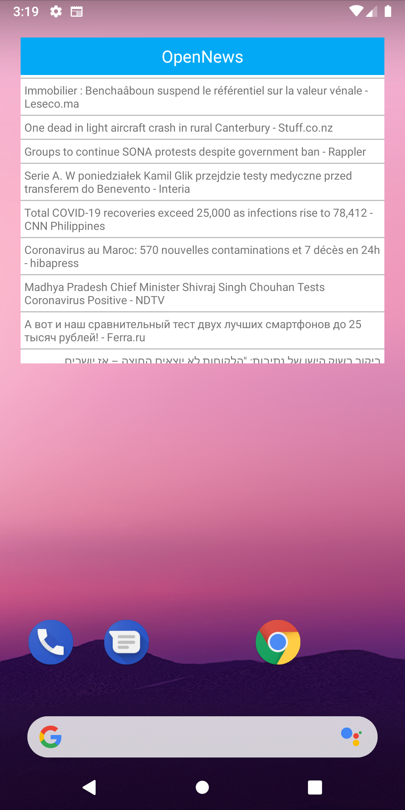

#### Tablet Devices (With Master Detail Flow)

	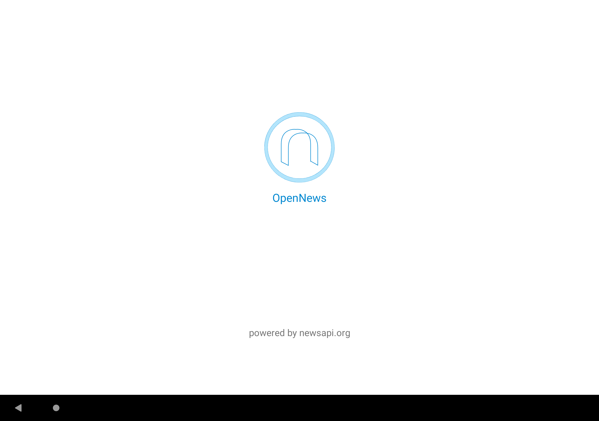
	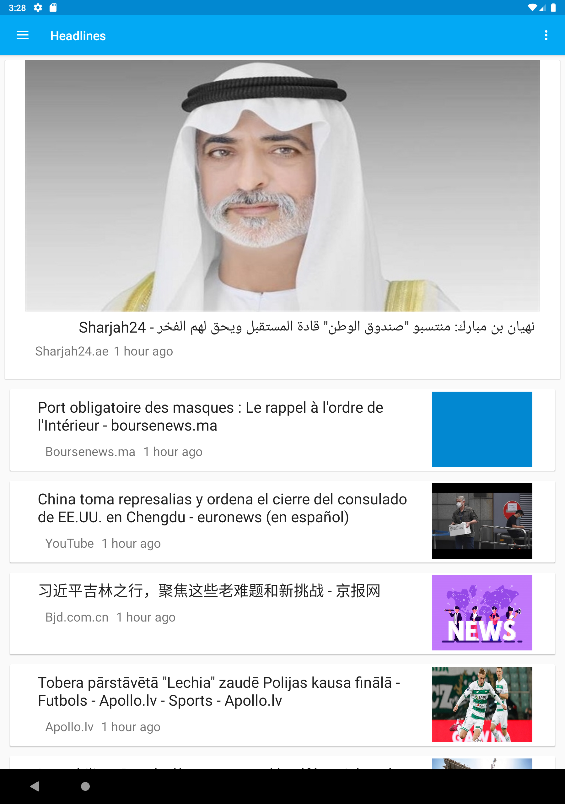
	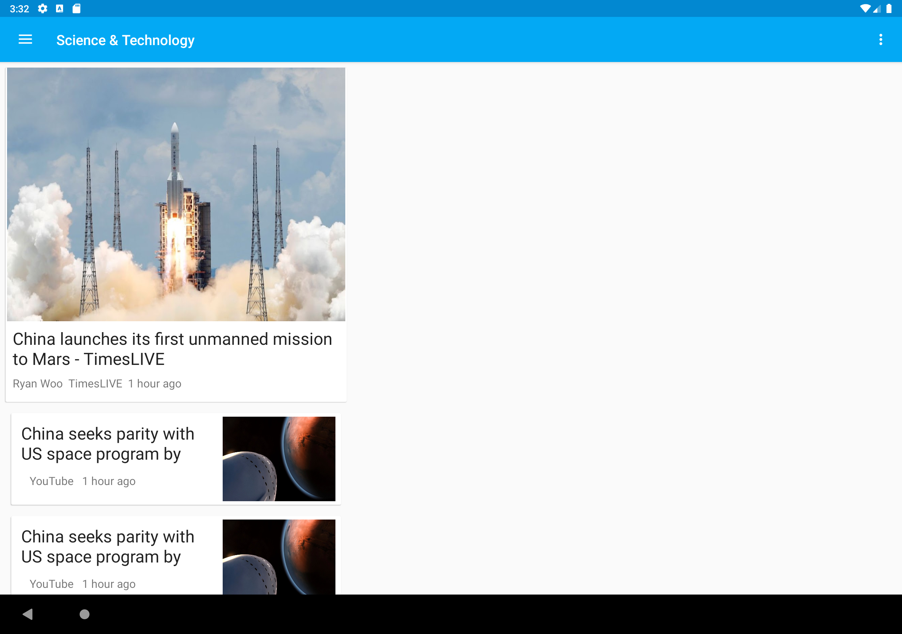

### Plan ahead
Make app more stable. There are few scenraios I need to optimise as well. For example, there should be a smooth transition from landscape to portrait mode. There is a need of some other functionalities which will be useful. For example, search bar, filter options, daily notifications and subscriptions.

### That is it for this app!
That is it for the course to be honest. I did learn a lot of stuff from course as well as the official documentation. Although I am going to fix some more issues in this repo, I will be surely working on some other Android projects. Until, next time.

Peace!