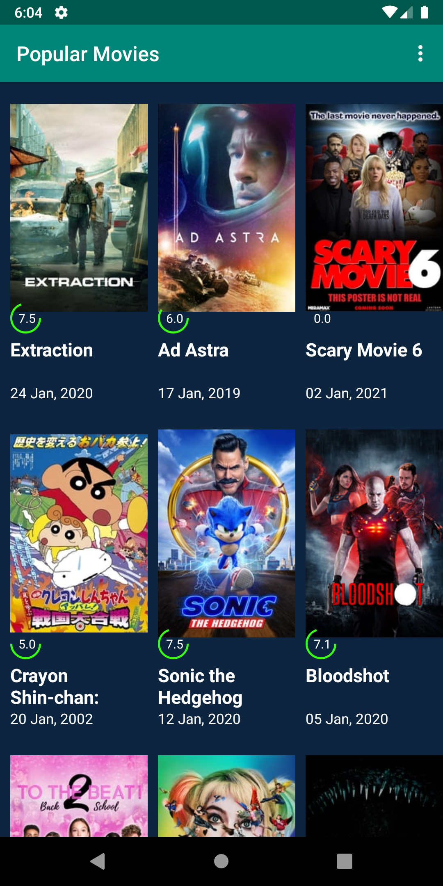
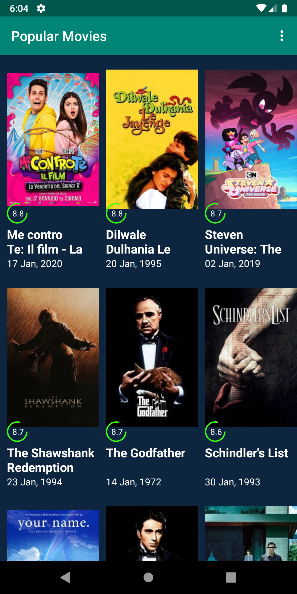
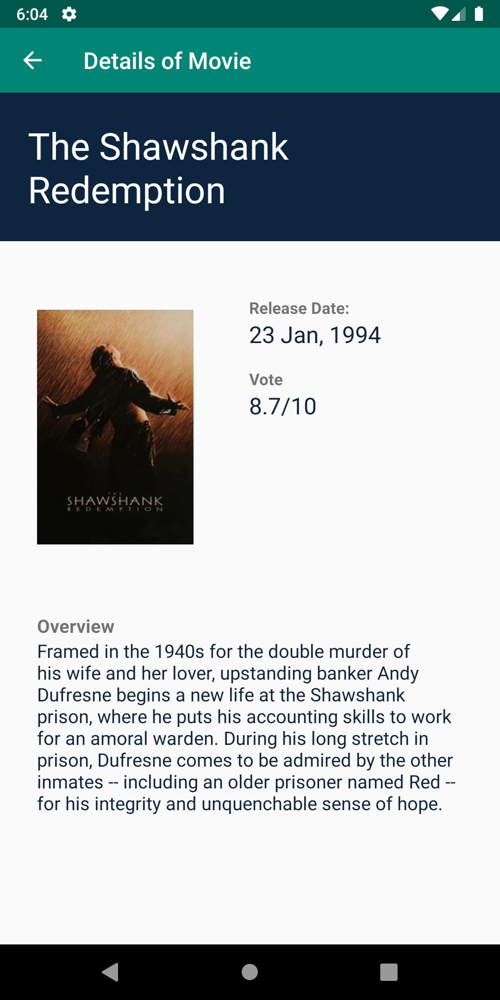

### App Description
This app was the second project to be developed in the curriculum. The first part of the app included the tasks to create efficient calls to API themoviedb.org Also, a good menu to switch between popular and highest rated movies. These movies are displayed in Grid like fashion with maximum columns depending on screen size.
### How to use
Clone the repository.
You need an API key to fetch results from themoviedb.org which you can get [here](https://developers.themoviedb.org/3).
Place this api-key in MovieDBUtils.java where you can find a TODO task.
That's it. Build and run the app.

### Part II
This was the starting point of the app as I said. In next part, I implemented functionalities to mark a movie as favourite, share it and watch trailers of that movie.

### Screenshots

	
	
	

