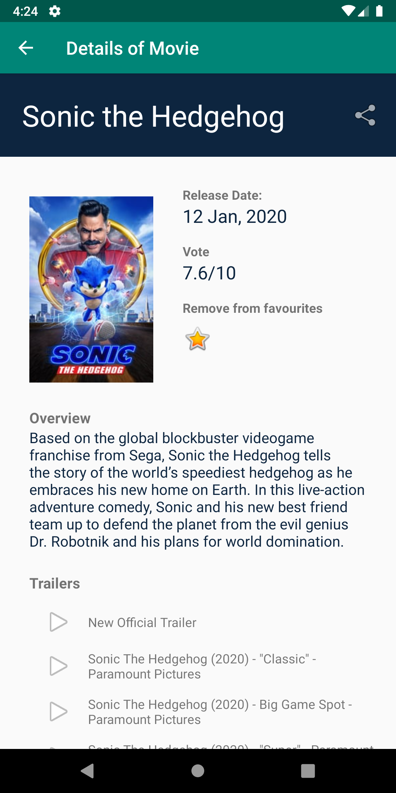
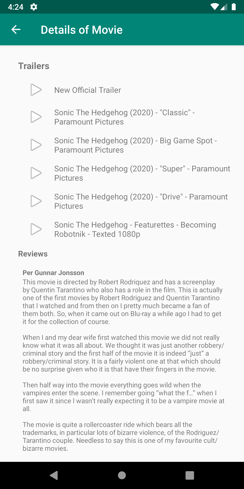
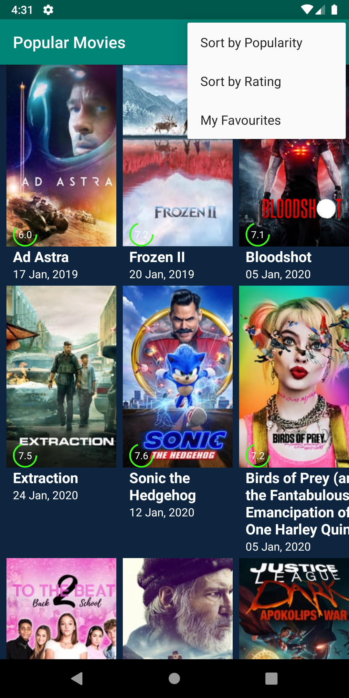
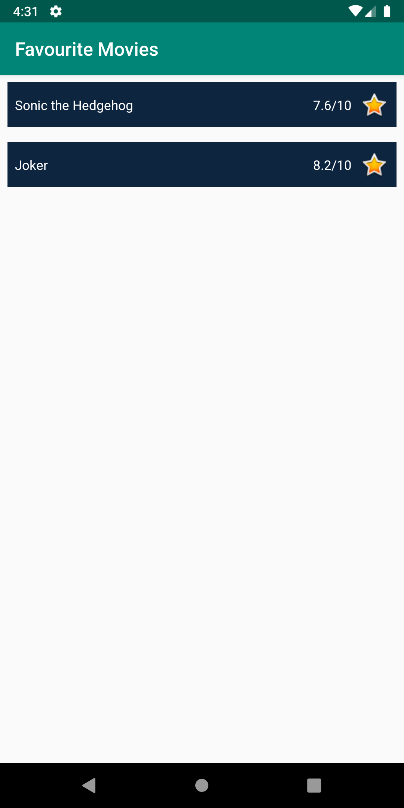
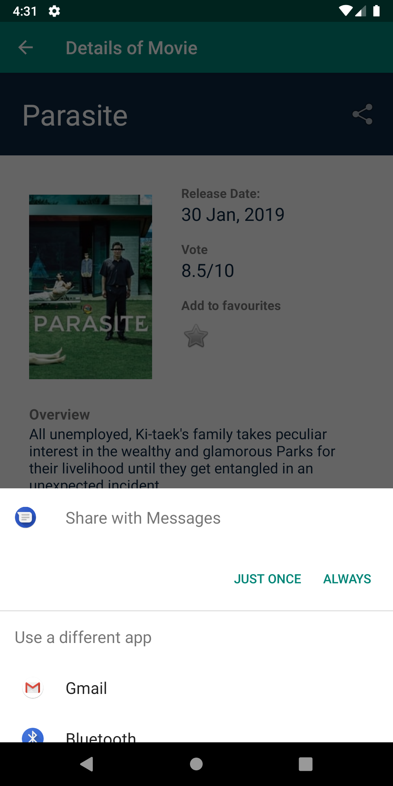

### App Description
This is the second part or perhaps an extension of the Popular Movies app built in the project. The previous version could only show the names and ratings of the movies. Of course that was not enough. In this part, following functions are added in the app.
<ul>
	<li>Added function to mark a movie as favourite</ll>	
	<li>Added Room database to save favourite movies</li>
	<li>Details screen of movie shows trailers of the movie.</li>
	<li>Reviews of the movie added on details screen below the trailers</li>
	<li>Share button added on details screen</li>
</ul>

### How to use
Clone the repository. You need an API key to fetch results from themoviedb.org which you can get [here](https://developers.themoviedb.org/3). Place this api-key in MovieDBUtils.java where you can find a TODO task. That's it. Build and run the app.

### Screenshots

	
	
	
	
	

### Plan ahead
I plan to sync the screens in the app with Room database completely. Next is to add fetch results in more size, filter the results and much more. 

### That is it for this app!
Yes, I passed this assignment easily. I got to learn about Android architecture components, Room, ViewModel, LiveData and much more. The next app was a bit intense. It was a baking app, which shows steps to bake some cakes. I used MasterDetail Flow in this and ExoPlayer to show videos. 