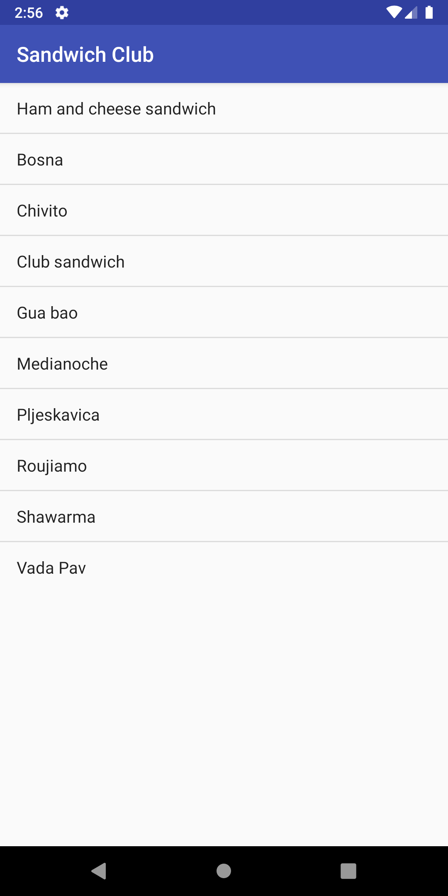
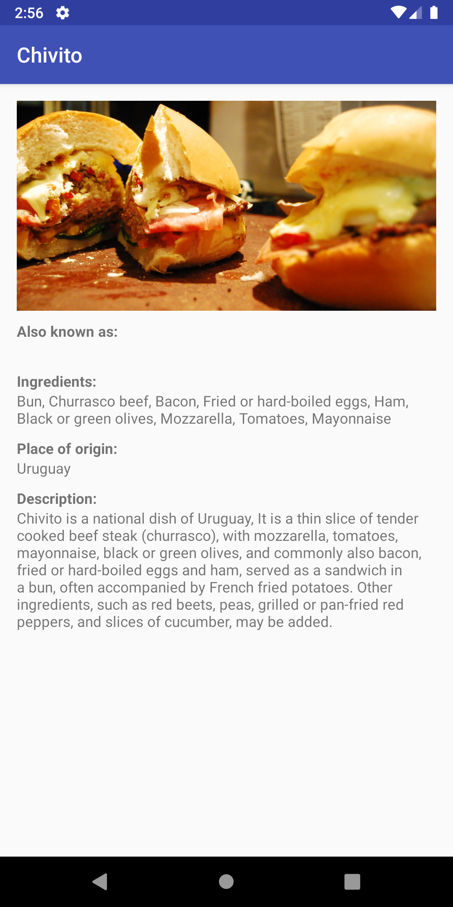

# Sandwich Club Project Starter Code

## Project Overview
In this project, you will complete the **Sandwich Club** app to
show the details of each sandwich once it is selected.
This is a simple project. It introduces to JSON parsng in Android.
Screenshots of this simple app after completion is - 
 
 

## Why this Project

Building a layout and populating its fields from data received as JSON
is a common task for Android Developers. Although JSON parsing is usually
done using libraries, writing the JSON parsing for  this project will
help you to better understand how it is processed.

## What Will I Learn?
Through this project, you will:
- Learn how to submit projects for review
- Practice JSON parsing to a model object
- Design an activity layout
- Populate all fields in the layout accordingly

## How Do I Complete this Project?
Download the [Sandwich Club app starter code.](https://github.com/udacity/sandwich-club-starter-code)

Design the layout for the detail activity so the different elements
display in a sensible way. Implement the JSON parsing in JsonUtils so it
produces a Sandwich Object that can be used to populate the UI that you designed.
