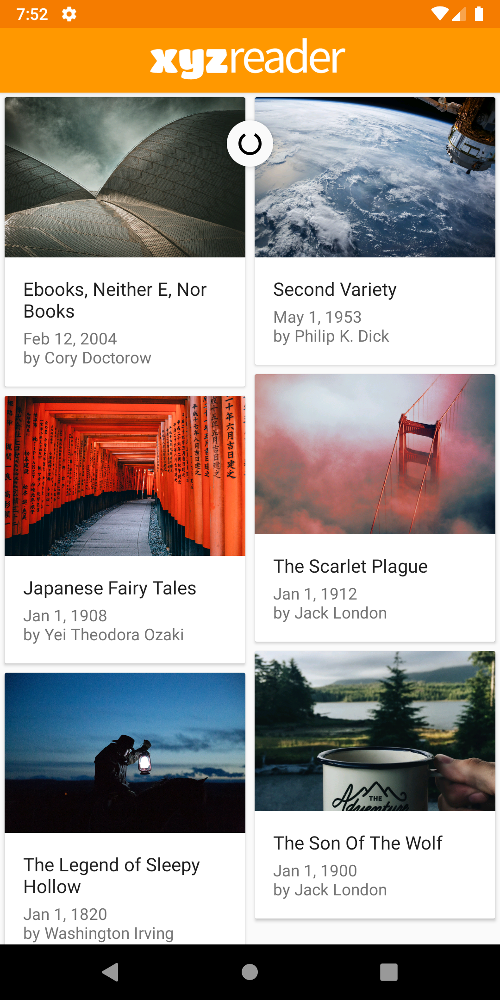
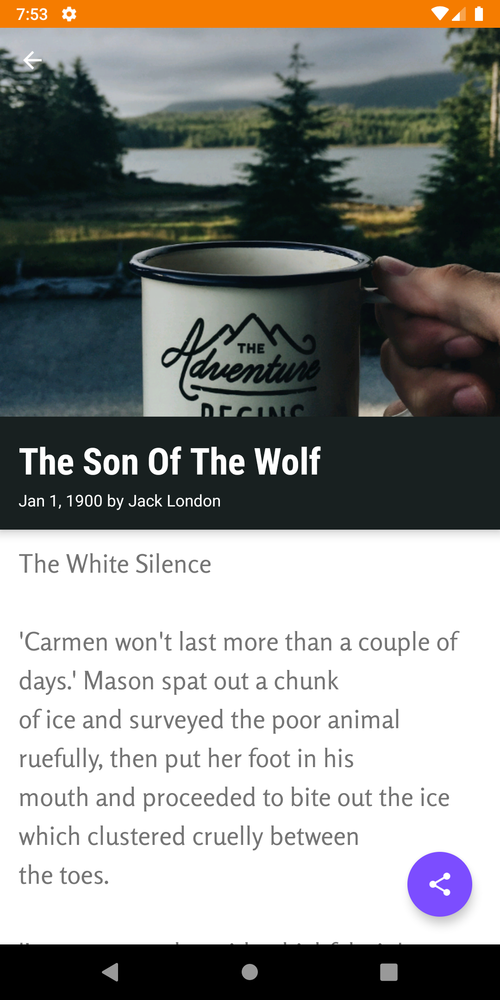
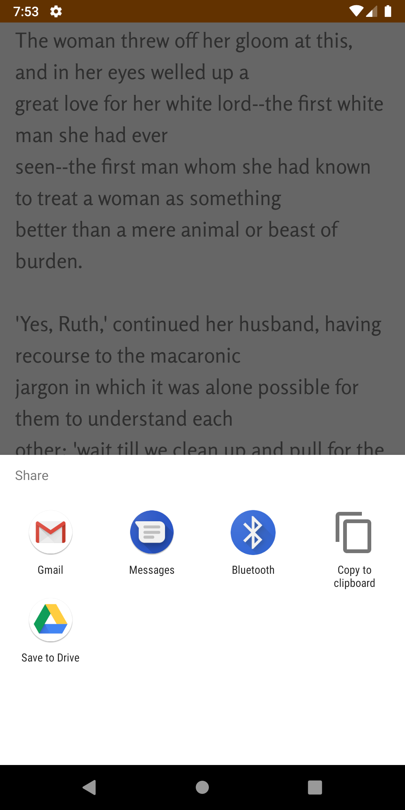

### XYZ Reader
In this project, the main focus was not functionality of the app but the user interface of the app. Android apps heavily focus on giving ease-of-access to each feature. Partially developed app was provided and the task was to polish the UI in order to make it usable. XYZ Reader is a simple application which allows user to read some stories and articles. The app focuses on giving easy access, readable interface, etc.
### Material Design
The app uses Google's [Material Design](https://material.io/) guidelines. The palette of primary and accent colours was chosen using same guidelines.
### How to use this
Simply clone the repository. Open the project in Android Studio and install in emulated or real device. You can use gradle as well if you are a terminal-person :)
### Screenshots

	
	
	

### Plan Ahead
No plan to work on this project yet. If I come back to this or anyone wants to work on it, creating useful motions and animations can be considered.